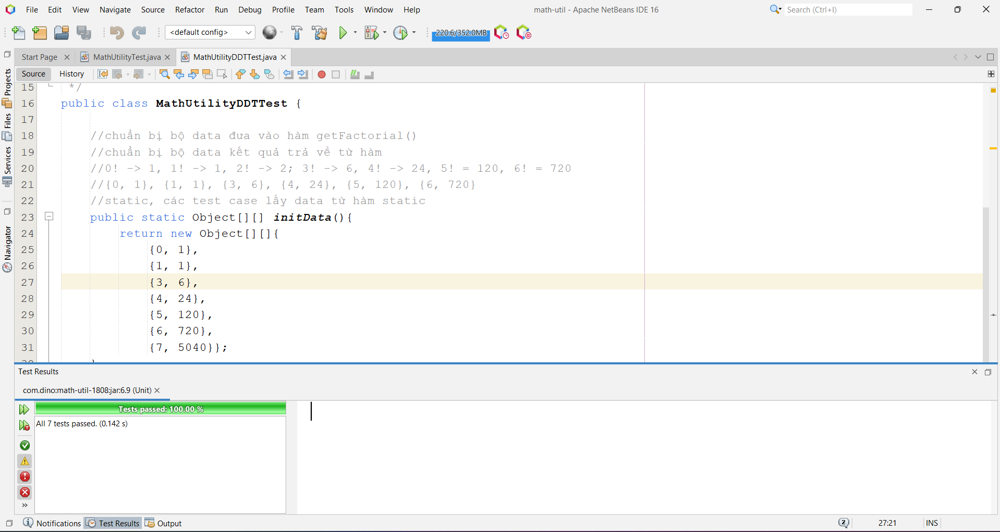

# Welcome to Math Utility Repository ver. 7.6.2024
## You will find in this repo the following stuff
* A Math Utility source code to demonstrate the Math library using Java
* A Unit Test test script using JUnit Tesing Framework to ensure the quality of source code
* The test script to demonstrate the TDD, DDT and Regresstion Testing techniques
* The CI (Continuous Integration) script to apply CI process
* Demonstrate the confliction on pushing
* ...
### Screenshots

#### Connect me via: viethoang5020@gmail.com
##### &#169; 2024 dino
